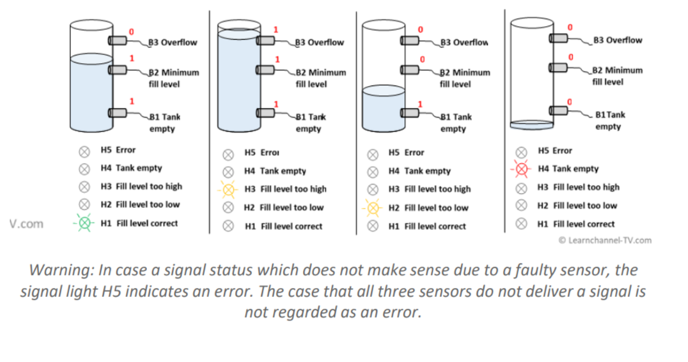

# **PLC \- PROGRAMMING LADDER LOGIC REINFORCEMENT ACTIVITY 2.3 IIOT, 2025-2**

Juan Diego Lemus Rey \- 0000243911

How can industrial automation be utilized to automate the monitoring of chemical liquid tank levels, thereby reducing both energy consumption and liquid waste?

Given this instructions of sensor and indicators:

| B3  | B2  | B1  | H5  | H4  | H3  | H2  | H1  | Meaning |
| --- | --- | --- | --- | --- | --- | --- | --- | :------ |
| 0   | 0   | 0   | 0   | 1   | 0   | 0   | 0   | Empty   |
| 0   | 0   | 1   | 0   | 0   | 0   | 1   | 0   | Low     |
| 0   | 1   | 0   | 1   | 0   | 0   | 0   | 0   | Error   |
| 0   | 1   | 1   | 0   | 0   | 0   | 0   | 1   | OK      |
| 1   | 0   | 0   | 1   | 0   | 0   | 0   | 0   | Error   |
| 1   | 0   | 1   | 1   | 0   | 0   | 0   | 0   | Error   |
| 1   | 1   | 0   | 1   | 0   | 0   | 0   | 0   | Error   |
| 1   | 1   | 1   | 0   | 0   | 1   | 0   | 0   | High    |

With all boolean variables being I/O pins, B_Inputs and H_Outputs… We proceed to the Ladder Logic.

I0.1 \* I0.2 \* \\I0.3 → Q0.1 (OK)

I0.1 \* \\I0.2 \* \\I0.3 → Q0.2 (Low)

I0.1 \* I0.2 \* I0.3 → Q0.3 (High)

\\I0.1 \* \\I0.2 \* \\I0.3 → Q0.4 (Empty)

\\I0.2 \* I0.3 \+ \\I0.1 \* I0.2→ Q0.5 (Error)

Additionally the lines should also make a control of whatever they are using to fill the tank so let’s assume an IN Pump as Q0.6 and a 3 state OUT Valve as Q0.7 \+ Q0.8:

(0,0 \= 0% OPEN); (0,1 or 1,0 \= 50% OPEN); (1,1 \= 100% OPEN).

1. \\I0.1 \* I0.2 \* I0.3 → Q0.1

   OK: 100% Valve, Pump ON, Indicator H1

2. \\I0.1 \* \\I0.2 \* I0.3 → Q0.2

   LOW: 50% Valve, Pump ON, Indicator H2

3. I0.1 \* I0.2 \* I0.3 → Q0.3

   HIGH: 100% Valve, Pump OFF, Indicator H3

4. \\I0.1 \* \\I0.2 \* \\I0.3 → Q0.4

   EMPTY: 0% Valve, Pump ON, Indicator H4

5. I0.2 \* \\I0.3 \+ I0.1 \* \\I0.2 → Q0.5

   ERROR: 0% Valve, Pump OFF, Indicator H5

Ii will look like this in LADDER:  

We can use the output Coils also as input Contractors; and since some of the outputs I aggregated arbitrary for the control are similar, managing a single output with multiple network lines might lead to contradictions, it is better if they are grouped like this:

6. H1 \+ H2 \+ H4 → Q0.6
7. H1 \+ H2 \+ H3 → Q0.7
8. H1 \+ H3 → Q0.8

This way there will only be one network line managing each output, like the following:

Now, with our logic we can proceed to the human interface HMI display, in this case with some creativity we can simulate and illustrate what is happening at the same time using CODESYS Visualization tool like this:  

In this case, the Switches represent the sensors B3, B2, B1 respectively (top to bottom) so when the Switch is pressed means the sensor is sensing water, Inwards arrow is the IN pump being activated, Outgoing arrows indicate the 0, 50 or 100% water outflow. and the indicator lamps (top to bottom) are:

- H5 (Error)
- H3 (High)
- H1 (Ok)
- H2 (Low)
- H4 (Empty)

WORKING:  
Following a logic usage let’s check how it looks in OpenPLC and HMI:  
Case 1:

No sensor B1,B2 or B3 is on, the tank is empty so it will display the H4 indicator and turn on the pump to start filling it.

Case 2:

Sensor B1 is ON B2 and B3 are OFF, that turns ON H2, indicating LOW level, that opens the valve in half and keeps the pump flowing:

Case 3:

Sensor B1 and B2 are ON, so the level is just right, meaning H1 indicator will be ON and the 100% of the water outflows through the valve and inflows with the pump like this:

Case 4:

All 3 Sensors are ON, meaning the tank is overflown, that turns H3 indicator ON, keeps the outflow valve 100% open and this time it does turn OFF the incoming Pump.

Error Cases:

Cases that are impossible to occur naturally, meaning a sensor malfunction or a transmission error, anyhow it turns ON the H5 indicator, everything else is OFF and it requires human revision…:

